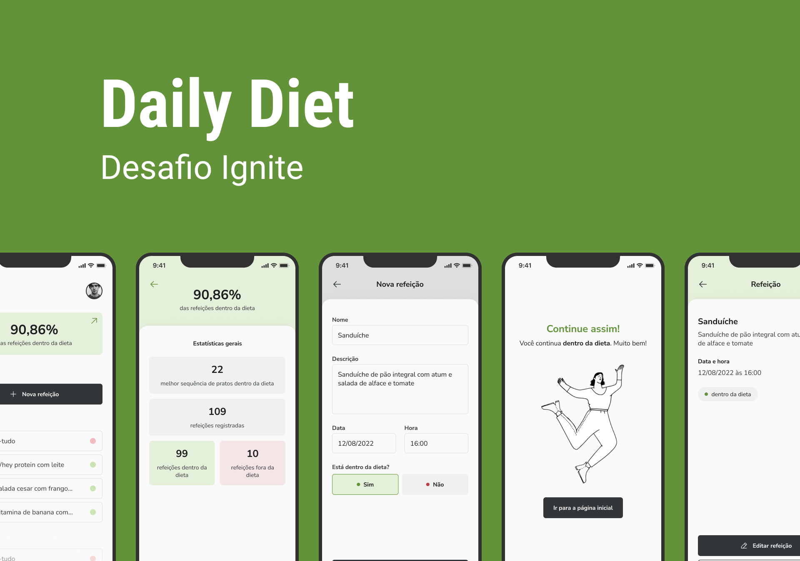
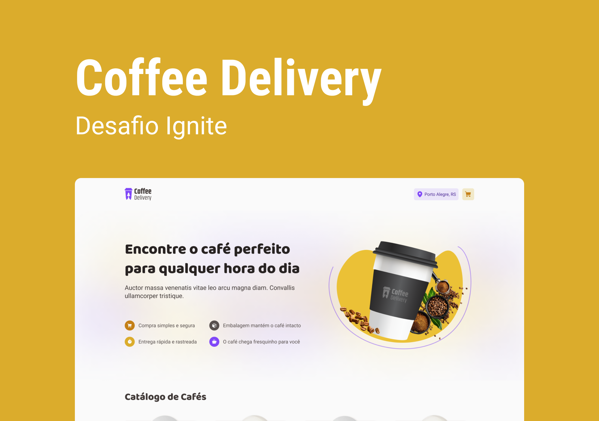

# Desafios Ignite 

Repositório destinado a armazenar todas as resoluções dos desafios que desenvolvi do ignite da rocketseat.

 

## To-Do List - React Native 📱

Durante este desafio, utilizamos os conceitos básicos do React Native desenvolvendo do zero uma simples lista de tarefas com as opções de criar e apagar um item da lista.

### 🛠️ Nesse projeto foi utilizado

- Expo
- TypeScript
- Styled-Components
- AsyncStorage

 

  

      

 
 

## Savepass - React Native 📱

O SavePass é o desafio principal do Capítulo 2 do bootcamp Ignite da trilha com React-Native. Nele, praticamos a lógica de programação com TypeScript para criação das funcionalidades desse aplicativo assim como toda estrutura para as requisições das funcionalidades desse aplicativo que utiliza o Async-Storage, ou seja o armazenamento local no dispositivo.

Além disso, revisamos estruturas com Try-Catch, ou seja, tratamos possíveis erros que podem ocorrer durante a execução de uma requisição, uso de métodos como include dentre outros.

### 🛠️ Nesse projeto foi utilizado

- Expo
- TypeScript
- Styled-Components
- AsyncStorage
- React Navigation
- React-native-uuid

 

  

 

## Dayli Diet - React Native 📱

O aplicativo Daily-Diet é um app de monitoramento de dieta ideal para ser no seu usado no dia a dia, nele você pode registrar suas refeições diariamente e classificá-las da forma que quiser que o app vai armazená-las no armazenamento local do seu dispositivo, portanto só seram excluidas caso você desejar, outro ponto intessante é que o app tem uma tela exclusiva para as principais estatísticas das suas refeições, além das outras 5 páginas que compõe toda a aplicação

### 🛠️ Nesse projeto foi utilizado

- Expo
- TypeScript
- Styled-Components
- AsyncStorage
- React Navigation
- React-native-uuid
- React-Hook-Form
- Zod
- React Native Masked-Text

 

  

      

 
 

## Coffee Delivery - React/Nextjs 🌐

Durante este desafio, utilizamos conceitos um pouco mais avançados desenvolvendo do zero uma aplicação de encomenda de cafés! A aplicação conta com 3 telas sendo a primeira uma tela de apresentação e também de listagem dos cafés disponíveis. Na segunda tela, o usuário precisa preencher um formulário com seus dados de endereço e ao lado direito é possível visualizar os itens do carrinho, podendo alterar a quantidade ou remover o mesmo. Na terceira e última tela, é exibido uma confirmação do pedido e também os detalhes de entrega da compra.

### 🛠️ Nesse projeto foi utilizado

- React
- Nextjs
- Stitches
- LocalStore
- React-Hook-Form
- Zod
- Immer
- Radix

 

  

      

