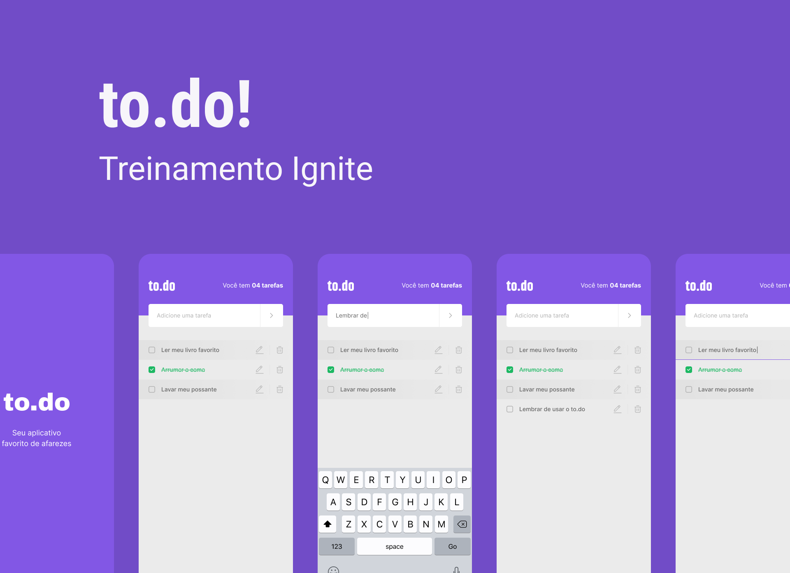

# Desafios Ignite 

Repositório destinado a armazenar todas as resoluções dos desafios que desenvolvi do ignite da rocketseat.

 

## To-Do List - React Native 📱

Durante este desafio, utilizamos os conceitos básicos do React Native desenvolvendo do zero uma simples lista de tarefas com as opções de criar e apagar um item da lista.

### 🛠️ Nesse projeto foi utilizado

- Expo
- Styled-Components
- TypeScript
- AsyncStorage

 

  

      

 
 

## Savepass - React Native 📱

O SavePass é o desafio principal do Capítulo 2 do bootcamp Ignite da trilha com React-Native. Nele, praticamos a lógica de programação com TypeScript para criação das funcionalidades desse aplicativo assim como toda estrutura para as requisições das funcionalidades desse aplicativo que utiliza o Async-Storage, ou seja o armazenamento local no dispositivo.

Além disso, revisamos estruturas com Try-Catch, ou seja, tratamos possíveis erros que podem ocorrer durante a execução de uma requisição, uso de métodos como include dentre outros.

 

### 🛠️ Nesse projeto foi utilizado

- Expo
- Styled-Components
- TypeScript
- AsyncStorage
- React Navigation
- React-native-uuid

 

  
  

 
